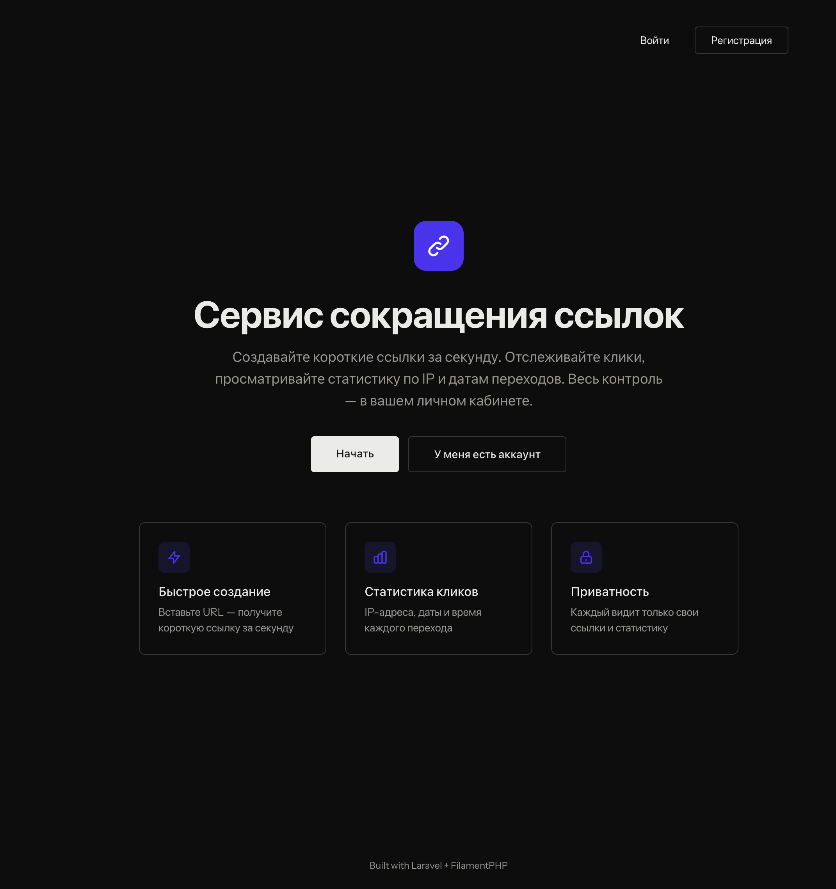
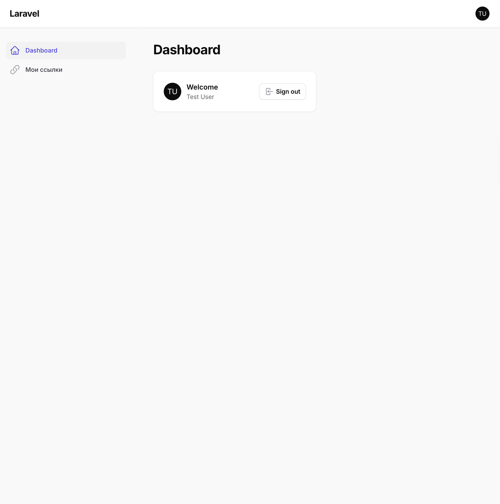
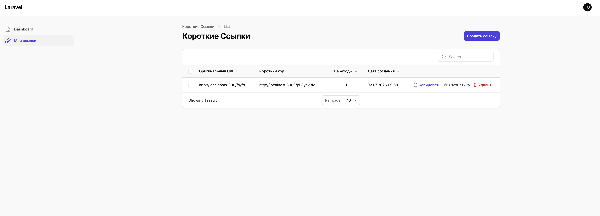
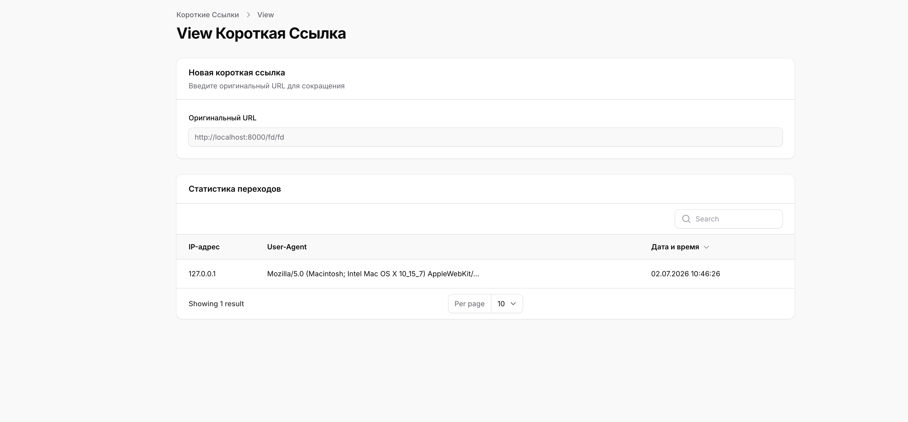

# ShortLink — Сервис сокращения ссылок

Веб-приложение на Laravel для создания коротких ссылок, отслеживания переходов и управления ссылками через личный кабинет.



---

## Описание проекта

**ShortLink** позволяет пользователям:

- Регистрироваться и входить в личный кабинет
- Создавать короткие ссылки из оригинальных URL
- Делиться короткими ссылками — любой может перейти по ней
- Отслеживать статистику переходов (IP-адрес, User-Agent, дата и время)
- Управлять своими ссылками (просматривать, удалять)

## Стек технологий

| Компонент | Технология |
|-----------|-----------|
| Backend | PHP 8.3+, Laravel 13 |
| Frontend | Inertia.js + Vue 3 + Tailwind CSS v4 |
| Админ-панель | FilamentPHP v3 |
| Аутентификация | Laravel Fortify |
| БД | SQLite (MySQL совместим) |
| Тестирование | PHPUnit 12 |
| Форматирование | Laravel Pint |

## Запуск проекта

```bash
# 1. Установка зависимостей
composer install
npm install

# 2. Настройка окружения
cp .env.example .env
php artisan key:generate

# 3. Миграции
php artisan migrate

# 4. Сборка фронтенда
npm run build

# 5. Запуск сервера
composer run dev
```

## Доступ к приложению

| Страница | URL |
|----------|-----|
| Главная | `/` |
| Регистрация | `/admin/register` |
| Вход | `/admin/login` |
| Личный кабинет | `/admin` |
| Управление ссылками | `/admin/short-links` |

## Структура проекта

```
app/
├── Filament/Resources/
│   └── ShortLinkResource.php          # Ресурс Filament для ссылок
│       ├── Pages/
│       │   ├── ListShortLinks.php     # Список ссылок
│       │   ├── CreateShortLink.php    # Создание ссылки
│       │   └── ViewShortLink.php      # Просмотр статистики
│       └── RelationManagers/
│           └── ClicksRelationManager.php  # Таблица кликов
├── Http/
│   ├── Controllers/
│   │   ├── ShortLinkController.php    # REST API (CRUD)
│   │   └── ShortLinkRedirectController.php  # Редирект
│   └── Requests/
│       └── StoreShortLinkRequest.php  # Валидация URL
├── Models/
│   ├── ShortLink.php                  # Модель короткой ссылки
│   └── Click.php                      # Модель клика
├── Policies/
│   └── ShortLinkPolicy.php            # Политика доступа
├── Services/
│   ├── ShortLinkService.php           # Бизнес-логика ссылок
│   ├── ClickService.php               # Запись статистики
│   └── RedirectService.php            # Логика редиректа
└── Providers/Filament/
    └── AdminPanelProvider.php          # Конфигурация Filament

database/
├── factories/ShortLinkFactory.php
└── migrations/
    ├── *_create_short_links_table.php
    └── *_create_clicks_table.php

tests/Feature/
├── ShortLinkTest.php                  # CRUD тесты
├── RedirectTest.php                   # Тесты редиректа
├── ClickStatisticsTest.php            # Тесты статистики
└── PolicyTest.php                     # Тесты авторизации
```

## Скриншоты

### Главная страница

Минималистичный лендинг с описанием возможностей сервиса и кнопками входа/регистрации.


### Личный кабинет (Dashboard)

Filament-панель с навигацией: Dashboard и "Мои ссылки".



### Управление короткими ссылками

Таблица с колонками: Оригинальный URL, Короткий код, Переходы, Дата создания. Действия: Копировать, Статистика, Удалить.



### Статистика переходов

Подробная информация по каждой ссылке: оригинальный URL и таблица кликов с IP-адресом, User-Agent и датой/временем перехода.



## API эндпоинты

| Метод | URL | Описание |
|-------|-----|----------|
| `GET` | `/links` | Список ссылок пользователя |
| `POST` | `/links` | Создать короткую ссылку |
| `GET` | `/links/{id}` | Статистика по ссылке |
| `DELETE` | `/links/{id}` | Удалить ссылку |
| `GET` | `/{shortCode}` | Редирект на оригинальный URL |

## Архитектура и принципы

- **SOLID** — каждый класс имеет одну ответственность
- **Service Layer** — вся бизнес-логика вынесена в сервисы
- **Policy** — авторизация доступа к ресурсам
- **FormRequest** — валидация входных данных
- **FilamentPHP** — админ-панель для CRUD операций

## Тестирование

```bash
# Все тесты
php artisan test --compact

# Конкретный тест
php artisan test --compact tests/Feature/RedirectTest.php
```

Тестовое покрытие: **56 тестов**, 169 ассертов.

## Лицензия

MIT
